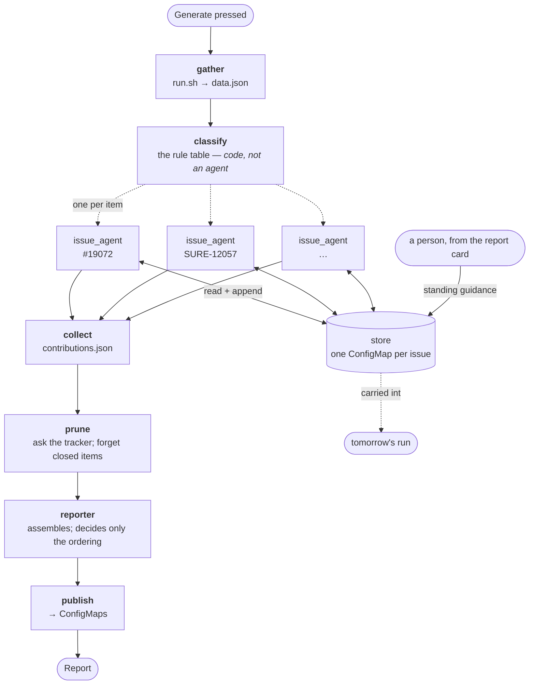

# How a report is made

The flow is spread across four files — `run.sh`, two embedded `node -e` blocks inside
`issue-round.sh`, `daily-report.prompt.md` and `publish.sh` — so it cannot be read from any one
of them. This is the shape.



## The two kinds of state

**A report is a thread.** Its working state — `data.json`, `contributions.json`, `report.json` —
lives in the run directory and dies with the run.

**An issue agent is the store.** One ConfigMap per issue
(`issue-<slug>`, label `interrupt-duty.rancher.io/kind=issue-history`), holding `standing[]`,
`log[]` and `last_seen`. It outlives every report. That is what lets an agent open with
"fourth report with nothing new" when no process of its own existed in between.

## Three things the picture makes obvious

- **`classify` has no LLM in it.** ACT_NOW / FOLLOW_UP / WAITING / TRACKED is one rule table
  applied once, in code, precisely so that N agents cannot each drift their own way. It is
  buried in a `node -e` block today.
- **The human edge does not enter the pipeline.** A note from the report card writes to the
  *store*, not to any run — which is why it reaches tomorrow without touching today.
- **There are no error edges drawn, and there are none in the code either.** Every stage is
  written as if it succeeds. The stage boundaries are already files on disk, so they are
  checkpoints waiting to be used.

## Regenerating this

The round **is** a LangGraph graph (`seed/round-graph.mjs`), so the picture comes from the code:

```sh
cd /workspace/.interrupt-duty && node round-graph.mjs --draw
```

The graph covers the **round** — `gather → prepare → issue_agent (one per item) → collect →
prune`. The reporter drives it and then writes and publishes the report itself, which is why
those two stages appear in the console's Pipeline view but not in the graph.

What LangGraph is and is not doing here:

| | |
|---|---|
| orchestrates the round as nodes and edges | yes |
| fan-out, one branch per item, merged by a reducer | yes |
| resumes a part-finished round without re-asking | yes — each answer is a file |
| checkpoint of its own (`checkpoints.db` in the run dir) | yes, when the native sqlite module is available |
| talks to a model | **no** — every node shells out to the same seed scripts |
| needs an API key | **no** — the agents stay Claude Code on the subscription |

`graph-deps.sh` installs `@langchain/langgraph` beside the seed the first time a round runs:
22 seconds from scratch, silent and instant afterwards. The sqlite checkpointer is optional
because it is a native module and a rebuilt agent image may not have a toolchain — without it
the graph still resumes, because the resumability lives in the answer files rather than in the
checkpointer.

**Still sequential.** The graph makes parallelism possible; a herd of claudes on the node that
also runs Rancher has taken it down before, which has not changed.
